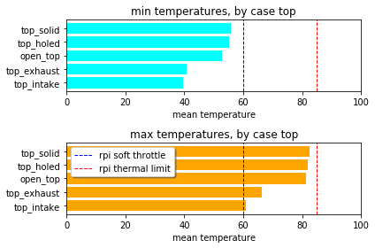
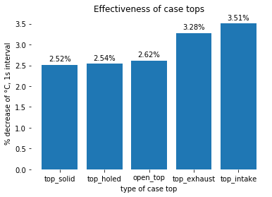
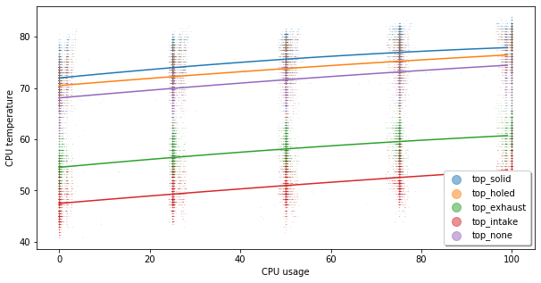

# Modelling raspberry pi temperatures


This project uses Python to analyze Raspberry Pi 3B CPU temperatures. Since the official Raspberry Pi case is modular, different case configurations are tested under load, and the data is graphed and modelled. The analysis shows us which case configurations are the best and gives us an idea of how much heat each piece of the case helps eliminate.

## Table of contents

* [Breaking down the modular case](#Breaking-down-the-modular-case)
* Project overview
* Experiment 1: simulated usage
  * Physical setup
  * Data collection script
  * What the data represents
  * Breaking down the data
* Experiment 2: heating-up and cooling-down cycles
  * Motivation
  * Physical setup
  * Data collection script
  * Modelling temperature

## Breaking down the modular case

The official Raspberry Pi 3B case is modular. The parts all snap together without the need for screws, so it's a really satisfying case to play with.

In the data, the presence and absence of the case parts is tracked with the following variables. A case without a top panel is considered the base/reference configuration, so it doesn't have a variable.

| Case part                      | Column name   |
|--------------------------------|---------------|
| Bottom                         | `case_bottom` |
| Frame                          | `case_frame`  |
| Side panel with HDMI and power | `case_cable`  |
| Side panel on GPIO side        | `case_gpio`   |
| Case without a top panel       | (reference)   |
| Solid top panel                | `top_solid`   |
| Top panel with a hole, no fan  | `top_holed`   |
| Top panel with an intake fan   | `top_intake`  |
| Top panel with an exhaust fan  | `top_exhaust` |

The case bottom has little risers that fit in the PCB's mounting holes.


The case frame secures the USB and ethernet ports, as well as covering some of the top.


The GPIO side panel is solid. The "cable" side panel surrounds the HDMI and power cables. Both side panels can only be installed if the case frame and the bottom panel are present.


The top panel completely covers the top of the case. It clips onto the case frame, so the latter must be present to install the top panel.

You can see my improvised fan connector. The fan came with regular-sized Dupont connectors, which are much too high for the case.


The fully assembled case looks nice, but you can already see that it will trap in heat if not ventilated. The whole thing is sealed-up tight.


I also test different top panel types, with the reference being no top panel at all. Since I had to drill a hole into the case for the fan, the "solid" top panel is now two layers of duct tape.


Finally, the Pi-FAN (5V; 0.10A) and heatsinks can be found online for fairly cheap. The variety pack below only cost $10. My Raspberry Pi 3B has two aluminium heatsinks installed (bottom right).


## Looking at the temperature range

The `04_minmax_test.py` temperature logging script tests for temperature minimum and maximums by having the case heat up (100% usage) and then cool down (~0% usage). When a temperature is maintained for 30 seconds, it's logged.

We can see below that all cases stay below the rpi's soft throttle of 60C, when at rest. When the rpi is at 100% usage, the cases without fans get very close to the rpi's maximum temperature limit. (At temperatures like these the CPU will slow down a lot to prevent damage, so you're also getting performance impact.)



## Estimating heat dissipation of case tops

By running a very basic time series model, we can get a basic idea of how much heat the tops get out of the case. A closed case will still eliminate heat through the plastic, and an open one will let hot air rise up and out.



## Full model

Below is the output of the model running on the most extensive dataset, with 17 case configurations tested.

The `coef` column gives the estimated effect of each case part.

These tests were all run with the raspberry pi plugged into a monitor with an HDMI cable. Interestingly, it seems that this made the plastic gpio panel dissipate some heat. The USB and HDMI plugs are warm to the touch while the rpi is running, so I think it helped a bit to have that plastic close by (not that they're touching; the case is fairly loose).

The intake fan had the most impact on the case temperatures, followed by the exhaust fan. All tests have been done with some cheap aluminium heatsinks on the two rpi ICs. Having cool air blowing directly on that SoC heatsink is certainly going to help a lot with temperatures!

```
                            OLS Regression Results                            
==============================================================================
Dep. Variable:                   temp   R-squared:                       0.879
Model:                            OLS   Adj. R-squared:                  0.879
Method:                 Least Squares   F-statistic:                 4.951e+04
Date:                Wed, 05 Aug 2020   Prob (F-statistic):               0.00
Time:                        08:09:24   Log-Likelihood:            -1.6432e+05
No. Observations:               61058   AIC:                         3.287e+05
Df Residuals:                   61048   BIC:                         3.288e+05
Df Model:                           9                                         
Covariance Type:            nonrobust                                         
===============================================================================
                  coef    std err          t      P>|t|      [0.025      0.975]
-------------------------------------------------------------------------------
Intercept      65.8071      0.063   1049.222      0.000      65.684      65.930
usage           0.0615      0.000    149.541      0.000       0.061       0.062
case_under      0.6286      0.084      7.473      0.000       0.464       0.793
case_frame      0.7365      0.075      9.846      0.000       0.590       0.883
case_cable     -0.9833      0.036    -27.190      0.000      -1.054      -0.912
case_gpio       2.4387      0.033     72.836      0.000       2.373       2.504
top_solid       4.3315      0.055     79.262      0.000       4.224       4.439
top_holed       2.1087      0.056     37.944      0.000       2.000       2.218
top_intake    -19.5402      0.060   -323.340      0.000     -19.659     -19.422
top_exhaust   -13.6484      0.056   -245.543      0.000     -13.757     -13.539
==============================================================================
Omnibus:                    19120.932   Durbin-Watson:                   0.065
Prob(Omnibus):                  0.000   Jarque-Bera (JB):            86514.542
Skew:                          -1.472   Prob(JB):                         0.00
Kurtosis:                       8.034   Cond. No.                         477.
==============================================================================

Warnings:
[1] Standard Errors assume that the covariance matrix of the errors is correctly specified.
```

Unfortunately, I've only been stressing the CPU by thread number. If I could stress the CPU with more finely-tuned usage levels, we could see if there's a curve to the data. (I wonder if there's any practical value to this, but I think it's fun regardless.)


