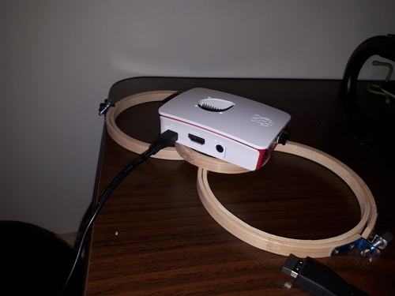
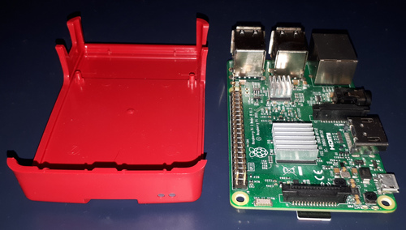
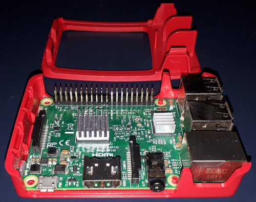
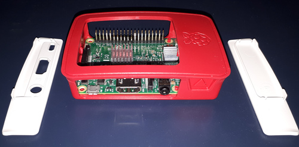
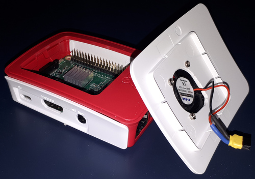
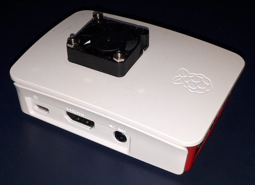
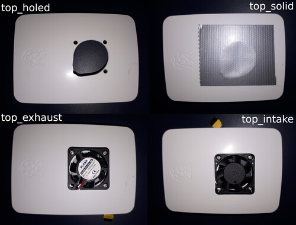
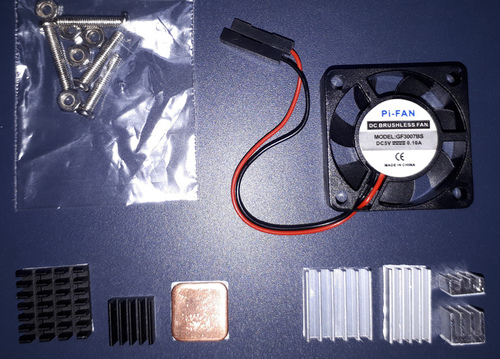
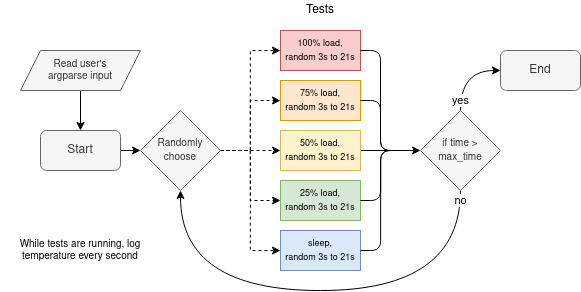
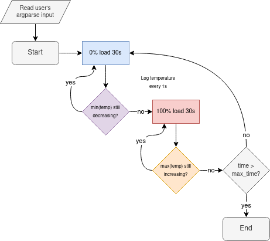

# Modelling raspberry pi temperatures

This project uses Python to analyze Raspberry Pi 3B CPU temperatures. Since the official Raspberry Pi case is modular, different case configurations are tested under load, and the data is graphed and modelled. The analysis shows us which case configurations are the best and gives us an idea of how much heat each piece of the case helps eliminate.

## Table of contents

* [Project overview](#Project-overview)
  * [Experiment 1: random usage](#Experiment-1:-random-usage)
  * [Experiment 2: min-max cycling](#Experiment-2:-min-max-cycling)
* [Breaking down the modular case](#Breaking-down-the-modular-case)
* [Experiment 1: random usage](#Experiment-1:-random-usage)
  * [Physical setup](#Physical-setup)
  * [Data collection script](#Data-collection-script)
  * [What the data represents](#What-the-data-represents)
  * [Breaking down the data](#Breaking-down-the-data)
* [Experiment 2: min-max cycling](#Experiment-2:-min-max-cycling)
  * [Motivation](#Motivation)
  * [Physical setup](#Physical-setup)
  * [Data collection script](#Data-collection-script)
  * [Modelling temperature](#Modelling-temperature)

## Project overview

I've split this project into two. The first half uses data from random usage, which might be closer to what day-to-day usage of the Pi is. The second half tries to address shortcomings of first approach, and uses data on how long the Pi takes to heat up to maximum temperature and then cool down to minimum temperature.

### Experiment 1: random usage

The data collection script randomly selects a usage level (0%, 25%, 50%, 75%, 100%) and a duration (3s to 21s) to run a test. Every second the usage level and the temperature is logged to a CSV file. I've tested 17 different combinations of the modular Raspberry Pi case for 1 hour each.

My analysis has found that closed cases run hotter. Having a fan cools the CPU a lot, with intake fans blowing directly onto the chip having the best effect.

The data collection process has some issues.

  1. The closed cases build up heat over 30-60 minutes (they're not stationary series)
  2. The usage is (mostly) discrete over 5 usage levels, making the data less rich
  3. There are dependencies between the case panels, so some panels have a lot more data in the 17 tests

### Experiment 2: min-max cycling

The second experiment addresses the issues of the previous experiment. The data collection script now lets the CPU cool to a minimum (0% usage; no new minimum temperature in 30s) and then lets it heat up to a maximum (100% usage; no new maximum temperature in 30s). It does this cooldown/warmup cycling for 2 hours. There were 5 tests, one for each type of case top panel.

  1. By reaching minimum and maximum temperatures, the data should be more stationary
  2. There are only two usage levels: 0% and 100%
  3. The 5 test cases are independant: they're mutually-exclusive top case panels

I modelled the data using an AR(1) linear model. The model showed again that the fans were best for reducing CPU temperatures. Thanks to the different data collection, the model should be giving more accurate estimates of heat dissipation.

## Breaking down the modular case

The official Raspberry Pi 3B case is modular. The parts all snap together without the need for screws, so it's a really satisfying case to play with.

In the data, the presence and absence of the case parts is tracked with the following variables. A case without a top panel is considered the base/reference configuration, so it doesn't have a variable.

| Case part                      | Column name   |
|--------------------------------|---------------|
| Bottom                         | `case_bottom` |
| Frame                          | `case_frame`  |
| Side panel with HDMI and power | `case_cable`  |
| Side panel on GPIO side        | `case_gpio`   |
| Case without a top panel       | (reference)   |
| Solid top panel                | `top_solid`   |
| Top panel with a hole, no fan  | `top_holed`   |
| Top panel with an intake fan   | `top_intake`  |
| Top panel with an exhaust fan  | `top_exhaust` |

The case bottom has little risers that fit in the PCB's mounting holes.

The case frame secures the USB and ethernet ports, as well as covering some of the top.

The GPIO side panel is solid. The "cable" side panel surrounds the HDMI and power cables. Both side panels can only be installed if the case frame and the bottom panel are present.

The top panel completely covers the top of the case. It clips onto the case frame, so the latter must be present to install the top panel.

You can see my improvised fan connector. The fan came with regular-sized Dupont connectors, which are much too high for the case.

The fully assembled case looks nice, but you can already see that it will trap in heat if not ventilated. The whole thing is sealed-up tight.

I also test different top panel types, with the reference being no top panel at all. Since I had to drill a hole into the case for the fan, the "solid" top panel is now two layers of duct tape.

Finally, the Pi-FAN (5V; 0.10A) and heatsinks can be found online for fairly cheap. The variety pack below only cost $10. My Raspberry Pi 3B has two aluminium heatsinks installed (bottom right).

## Experiment 1: random usage

### Physical setup

### Data collection script

[./00_temp_test.py](./00_temp_test.py)

[./01_data.ipynb](./01_data.ipynb)

### What the data represents

[./02_descriptive.ipynb](./02_descriptive.ipynb)

### Breaking down the data

[./03_linear_models.ipynb](./03_linear_models.ipynb)

## Experiment 2: min-max cycling

### Motivation

### Physical setup

### Data collection script

[./04_minmax_test.py](./04_minmax_test.py)

### Modelling temperature

[./05_time_series.ipynb](./05_time_series.ipynb)