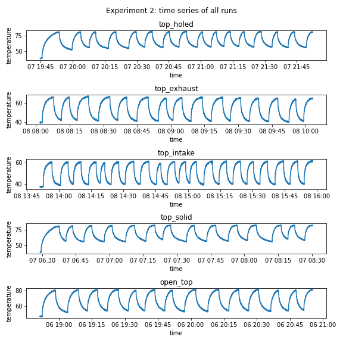

# Modelling raspberry pi temperatures


This project uses Python to analyze Raspberry Pi 3B CPU temperatures. Since the official Raspberry Pi case is modular, different case configurations are tested under load, and the data is graphed and modelled. The analysis shows us which case configurations are the best and gives us an idea of how much heat each piece of the case helps eliminate.

## Table of contents

* [Project overview](#Project-overview)
  * [Experiment 1: random usage](#Experiment-1-random-usage)
  * [Experiment 2: min-max cycling](#Experiment-2-min-max-cycling)
* [Breaking down the modular case](#Breaking-down-the-modular-case)
* [Experiment 1: random usage](#Experiment-1-random-usage)
  * [Physical setup](#Physical-setup)
  * [Data collection script](#Data-collection-script)
  * [What the data represents](#What-the-data-represents)
  * [Breaking down the data](#Breaking-down-the-data)
  * [Basic modelling](#Basic-modelling)
* [Experiment 2: min-max cycling](#Experiment-2-min-max-cycling)
  * [Motivation](#Motivation)
  * [Physical setup](#Physical-setup)
  * [Data collection script](#Data-collection-script)
  * [Modelling temperature](#Modelling-temperature)

## Project overview

I've split this project into two. The first half uses data from random usage, which might be closer to what day-to-day usage of the Pi is. The second half tries to address shortcomings of first approach, and uses data on how long the Pi takes to heat up to maximum temperature and then cool down to minimum temperature.

### Experiment 1: random usage

The data collection script randomly selects a usage level (0%, 25%, 50%, 75%, 100%) and a duration (3s to 21s) to run a test. Every second the usage level and the temperature is logged to a CSV file. I've tested 17 different combinations of the modular Raspberry Pi case for 1 hour each.

My analysis has found that closed cases run hotter. Having a fan cools the CPU a lot, with intake fans blowing directly onto the chip having the best effect.

The data collection process has some issues.

  1. The closed cases build up heat over 30-60 minutes (they're not stationary series)
  2. The usage is (mostly) discrete over 5 usage levels, making the data less rich
  3. There are dependencies between the case parts, so some parts have a lot more data in the 17 tests (case frame is ~90% active)

### Experiment 2: min-max cycling

The second experiment addresses the issues of the previous experiment. The data collection script now lets the CPU cool to a minimum (0% usage; no new minimum temperature in 30s) and then lets it heat up to a maximum (100% usage; no new maximum temperature in 30s). It does this cooldown/warmup cycling for 2 hours. There were 5 tests, one for each type of case top panel.

  1. By reaching minimum and maximum temperatures, the data should be more stationary
  2. There are only two usage levels: 0% and 100%
  3. The 5 test cases are independant: they're mutually-exclusive top case panels

I modelled the data using an AR(1) linear model. The model showed again that the fans were best for reducing CPU temperatures. Thanks to the different data collection, the model should be giving more accurate estimates of heat dissipation.

## Breaking down the modular case

The official Raspberry Pi 3B case is modular. The parts all snap together without the need for screws, so it's a really satisfying case to play with.

In the data, the presence and absence of the case parts is tracked with the following variables. A case without a top panel is considered the base/reference configuration, so it doesn't have a variable.

| Case part                      | Column name   |
|--------------------------------|---------------|
| Bottom                         | `case_bottom` |
| Frame                          | `case_frame`  |
| Side panel with HDMI and power | `case_cable`  |
| Side panel on GPIO side        | `case_gpio`   |
| Case without a top panel       | (reference)   |
| Solid top panel                | `top_solid`   |
| Top panel with a hole, no fan  | `top_holed`   |
| Top panel with an intake fan   | `top_intake`  |
| Top panel with an exhaust fan  | `top_exhaust` |

The case bottom has little risers that fit in the PCB's mounting holes.


The case frame secures the USB and ethernet ports, as well as covering some of the top.


The GPIO side panel is solid. The "cable" side panel surrounds the HDMI and power cables. Both side panels can only be installed if the case frame and the bottom panel are present.


The top panel completely covers the top of the case. It clips onto the case frame, so the latter must be present to install the top panel.

You can see my improvised fan connector. The fan came with regular-sized Dupont connectors, which are much too high for the case.


The fully assembled case looks nice, but you can already see that it will trap in heat if not ventilated. The whole thing is sealed-up tight.


I also test different top panel types, with the reference being no top panel at all. Since I had to drill a hole into the case for the fan, the "solid" top panel is now two layers of duct tape.


Finally, the Pi-FAN (5V; 0.10A) and heatsinks can be found online for fairly cheap. The variety pack below only cost $10. My Raspberry Pi 3B has two aluminium heatsinks installed (bottom right).


## Experiment 1: random usage

### Physical setup

The first experiment has the Raspberry Pi on top of a paperback copy of Gene Wolfe's *Urth of the New Sun*. The Pi is connected by HDMI to a monitor so that I can run the scripts and manage the data.

The script is run for 17 different case configurations, and the Pi is shut down and left to cool down after each run. The case components are added/removed in-between runs.

I've noticed that heat does build up in the book, and I think the book ends up being a heat reserve that keeps the case warm over time.


### Data collection script

The script collects temperature data from randomly selected CPU loads, for randomly selected durations. This lets temperatures fluctuate over time, hopefully offering some variety in the dataset.


Data is collected according to case configurations. The script uses `argparse` to let the user enter the current case configuration, which will be coded in the filename.

  1.  (a) case_under
  2.  (b) case_frame
  3.  (c) case_cable
  4.  (d) case_gpio
  5.  (m) top_solid
  6.  (n) top_holed
  7.  (o) top_intake (fan)
  8.  (p) top_exhaust (fan)
  9.  (x) heatsink_main
  10. (y) heatsink_sub

For example, `case_under` and `case_frame` will be coded as `1100000000`.

  * The data collection script: [./00_temp_test.py](./00_temp_test.py)

The raw data is available as CSV files. The iPython notebook below saves the data as a pandas dataframe.

  * The iPython notebook to import the data: [./01_data.ipynb](./01_data.ipynb)

### What the data represents

The data collected for experiment might represent light natural usage of the Raspberry Pi as a desktop computer. The fluctuating usage levels could correspond to a user loading webpages, working on spreadsheets, and developing small scripts.

The experimental setup is not realistic for other common Pi uses. If you use your Raspberry Pi for streaming games, you'll likely to generate more heat from decoding the stream and receiving data over ethernet/wifi. The usage level of the CPU will likely be high and constant during your play session.

### Breaking down the data

The descriptive analysis of the data is available in this iPython notebook.

  * The iPython notebook looking at the data: [./02_descriptive.ipynb](./02_descriptive.ipynb)

Looking at all 17 time series, we can see that heat does build up significantly in certain case configurations. Some cases reach nearly 80C in 10-20 minutes and stay there.


Despite trying 17 different case configurations, the data is still imbalanced. This is unavoidable. You can't install the side panels without having the case bottom and frame present; therefore, the majority of runs will have the bottom and frame present.


Looking at the correlation of different variables with temperature, we see that some case parts are associated with lower CPU temperatures. Having case fans is associated with much lower case temperatures.

  * Read more about correlation: <https://en.wikipedia.org/wiki/Pearson_correlation_coefficient>

```
df.corr()["temp"]

usage            0.211161
temp             1.000000
stress           0.209753
case_under      -0.056786
case_frame      -0.092558
case_cable      -0.180056
case_gpio        0.142723
top_solid        0.477361
top_holed        0.324209
top_intake      -0.700335
top_exhaust     -0.386083
Name: temp, dtype: float64
```

Plotting the distributions of temperatures in different setups gives us some insights, but we're left a bit unsatisfied because of the imbalanced dataset (see the bar chart above). For example, we can't really make much sense of what happens when we put the case frame `on` since that includes about 90% of the data.


If we disregard most of the data and focus on the case bottom and case frame, we see there is not a huge difference whether these case parts are there.


### Basic modelling

It may be useful to model the data to see if there's anything to learn. Linear models are a way of quantifying statistical relationships in the data.

  * An iPython notebook looking at basic modelling: [./03_linear_models.ipynb](./03_linear_models.ipynb)

The model is a simple one with temperature as a function of CPU usage and the presence of different case parts. The case part variables are 0/1 values, known as dummy variables. If a dummy variable has a coefficient of 10.0, this implies that temperatures are 10C higher (on average) if this dummy variables is active.

The linear model shows us that `case_under` and `case_frame` aren't very strong, but the case fans do impact temperatures quite significantly (this is no surprise).

```
                            OLS Regression Results                            
==============================================================================
Dep. Variable:                   temp   R-squared:                       0.879
Model:                            OLS   Adj. R-squared:                  0.879
Method:                 Least Squares   F-statistic:                 4.951e+04
Date:                Mon, 07 Sep 2020   Prob (F-statistic):               0.00
Time:                        13:53:37   Log-Likelihood:            -1.6432e+05
No. Observations:               61058   AIC:                         3.287e+05
Df Residuals:                   61048   BIC:                         3.288e+05
Df Model:                           9                                         
Covariance Type:            nonrobust                                         
===============================================================================
                  coef    std err          t      P>|t|      [0.025      0.975]
-------------------------------------------------------------------------------
Intercept      65.8071      0.063   1049.222      0.000      65.684      65.930
usage           0.0615      0.000    149.541      0.000       0.061       0.062
case_under      0.6286      0.084      7.473      0.000       0.464       0.793
case_frame      0.7365      0.075      9.846      0.000       0.590       0.883
case_cable     -0.9833      0.036    -27.190      0.000      -1.054      -0.912
case_gpio       2.4387      0.033     72.836      0.000       2.373       2.504
top_solid       4.3315      0.055     79.262      0.000       4.224       4.439
top_holed       2.1087      0.056     37.944      0.000       2.000       2.218
top_intake    -19.5402      0.060   -323.340      0.000     -19.659     -19.422
top_exhaust   -13.6484      0.056   -245.543      0.000     -13.757     -13.539
==============================================================================
Omnibus:                    19120.932   Durbin-Watson:                   0.066
Prob(Omnibus):                  0.000   Jarque-Bera (JB):            86514.542
Skew:                          -1.472   Prob(JB):                         0.00
Kurtosis:                       8.034   Cond. No.                         477.
==============================================================================

Notes:
[1] Standard Errors assume that the covariance matrix of the errors is correctly specified.
```

We can use the model to predict what temperatures would be if only one case component were present. This doesn't give us a whole lot of information, but it's a way of trying to get rid of the dependence effect in the data. However, the model can only do so much: the coefficients on `case_under` and `case_frame` aren't that strong.


## Experiment 2: min-max cycling

### Motivation

The second experiment tries to get a more accurate temperature model by addressing some of the issues of the first experiment's data.

Issues with the first experiment's data:

  1. The closed cases build up heat over 30-60 minutes (they're not stationary series)
  2. The usage is (mostly) discrete over 5 usage levels, making the data less rich
  3. There are dependencies between the case parts, so some parts have a lot more data in the 17 tests (`case_frame` is ~90% active)

The second experiment addresses these issue.

  1. Let cases cool down and warm up completely so that the data is more stationary
  2. Abandon different usage levels, only use 0% (cooldown) and 100% (warmup)
  3. Have only 5 test cases, one for each top panel type

The second experiment's estimates should be closer to reality.

### Physical setup

The Raspberry Pi case is placed on wooden sewing rings to isolate it better from the desk. The Pi is not connected by HDMI to a monitor and instead communicates to the controlling computer by remote terminal.


### Data collection script

The data collection script now operates in cooldown and warmup cycles. It waits 30 seconds to declare a temperature a minimum (cooldown) or a maximum (warmup). Each run lasts 2 hours.

  * The modified data collection script: [./04_minmax_test.py](./04_minmax_test.py)

Here is a flowchart representation of the data collection script.


### Modelling temperature

  * The iPython notebook analysis of the data: [./05_time_series.ipynb](./05_time_series.ipynb)

Compared to the first experiment, the data in the second experiment is more stable. Even though some cases build up heat, once they've built it up they settle in regular series. The `top_solid` case takes 10 minutes to get hot and then settles into a stable oscillating series.



Experiment 2 collects minimum and maximum temperatures, which are interesting on their own. If we graph these minimums and maximums, we can see that it's pretty hard to keep the Raspberry Pi cool. Even with fans the Pi case reaches the soft throttle limit (60C) when working at 100%.


The model is an AR(1) process that describes current temperatures as a function of previous temperatures and usage levels. This is an autoregressive model, meaning that it tries predicting values from the same (previous) values.

  * Read more about autoregressive models: <https://en.wikipedia.org/wiki/Autoregressive_model>

The model used here is 

```
temp ~ usage_1           + temp_1
     + temp_1:top_solid  + temp_1:top_holed
     + temp_1:top_intake + temp_1:top_exhaust
```

The `temp_1:top_solid` notation signifies that the lagged temperature `temp_1` is multiplied by the 0/1 variable `top_solid`. This is known as an interaction.

*What does the model mean?* The current temperature is a function of previous temperature and CPU usage. If `temp_1` has a coefficient of `0.97`, 97% of the temperature is "retained" for the current temperature. If an intake fan is present and its coefficient is `-0.01`, then only 96% of the heat will be retained the next second.

The model below fits the data very well, according ot the R^2 statistic of 0.998. This means that the model is a reasonably good way of representing the temperature dataset from the dataset.

```
                            OLS Regression Results                            
==============================================================================
Dep. Variable:                   temp   R-squared:                       0.998
Model:                            OLS   Adj. R-squared:                  0.998
Method:                 Least Squares   F-statistic:                 3.750e+06
Date:                Mon, 07 Sep 2020   Prob (F-statistic):               0.00
Time:                        15:47:01   Log-Likelihood:                -25908.
No. Observations:               36857   AIC:                         5.183e+04
Df Residuals:                   36850   BIC:                         5.189e+04
Df Model:                           6                                         
Covariance Type:            nonrobust                                         
======================================================================================
                         coef    std err          t      P>|t|      [0.025      0.975]
--------------------------------------------------------------------------------------
Intercept              1.4558      0.027     54.911      0.000       1.404       1.508
usage_1                0.0061   9.31e-05     65.615      0.000       0.006       0.006
temp_1                 0.9738      0.000   2139.769      0.000       0.973       0.975
temp_1:top_solid       0.0010      0.000      8.466      0.000       0.001       0.001
temp_1:top_holed       0.0007      0.000      6.133      0.000       0.000       0.001
temp_1:top_intake     -0.0090      0.000    -43.924      0.000      -0.009      -0.009
temp_1:top_exhaust    -0.0066      0.000    -38.012      0.000      -0.007      -0.006
==============================================================================
Omnibus:                     4315.430   Durbin-Watson:                   2.618
Prob(Omnibus):                  0.000   Jarque-Bera (JB):            39040.757
Skew:                           0.208   Prob(JB):                         0.00
Kurtosis:                       8.025   Cond. No.                         954.
==============================================================================

Notes:
[1] Standard Errors assume that the covariance matrix of the errors is correctly specified.
```

In order to interpret the coefficients properly, we can add each interaction-dummy coefficient to the `temp_1` coefficient. This gives us an idea of how much heat (in degrees C) is eliminated each second by each case configuration (assuming 0% CPU usage).

